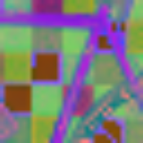

# Data Source Tutorial #

Most of the theory related to deep learning seems to focus on the models and training algorithms.
In this tutorial, we will explore how to prepare the data, which some may argue, is the most important *pratical* aspect of DL. 
We will show you how to build DataSources for image classification and language modeling. 

## Object Structure ##

Because it tries to be general enough for different use cases, 
the data interface for the dp package can seem a little complicated. 
We can divide the data interface into 5 levels of abstractions. 
From abstract to concrete these are:
 
 1. dp.DataSource : encapsulates 1 to 3 DataSets labeled *train*, *valid* and *test*. An example would be dp.PennTreeBank or dp.Mnist.
 2. dp.DataSet : encapsulates 1 or 2 DataViews accessed through the `inputs` and `targets` methods.
 3. dp.DataView : encapsulates a Tensor or a table thereof. Can reshape and transpose the Tensor from a stored to a desired `shape`.
 4. torch.Tensor : provides a view to a Storage. Where the storage is just an array of contiguous memory, the Tensor can be strided, multi-dimensional. 
 5. torch.Storage : encapsulates a pointer to an array of data (int, long, char, float, etc.). A storage can be shared by multiple Tensors, each having a different view of the data.

## Image Classification ##

In this section, we will build an image classification DataSource for face detection.
Ultimately, we want to use the dataset to train a classifier to discriminate betweene two classes of images : background or face. 
The dataset is provided as a compressed zip file made available by the University of Purdue at : 
[https://engineering.purdue.edu/elab/files/face-dataset.zip](https://engineering.purdue.edu/elab/files/face-dataset.zip).
Once downloaded and uncompressed, we find a directory or PNG images for each class : *bg/* and *face/*.
The images look like they have been preprocessed (maybe with local contrast normalization):

 


### The Lazy Way ###

If all we want to do is quickly prepare the data for our personal use, 
then we can create a function that will return a DataSource which we 
can then use to train a model :

```lua
require 'dp'
require 'torchx' -- for paths.indexdir

function facedetection(dataPath, validRatio)
   validRatio = validRatio or 0.15

   -- 1. load images into input and target Tensors
   local bg = paths.indexdir(paths.concat(dataPath, 'bg')) -- 1
   local face = paths.indexdir(paths.concat(dataPath, 'face')) -- 2
   local size = bg:size() + face:size()
   local shuffle = torch.randperm(size) -- shuffle the data
   local input = torch.FloatTensor(size, 3, 32, 32)
   local target = torch.IntTensor(size):fill(2)
   
   for i=1,bg:size() do
      local img = image.load(bg:filename(i))
      local idx = shuffle[i]
      input[idx]:copy(img)
      target[idx] = 1
      collectgarbage()
   end
   
   for i=1,face:size() do
      local img = image.load(face:filename(i))
      local idx = shuffle[i+bg:size()]
      input[idx]:copy(img)
      collectgarbage()
   end

   -- 2. divide into train and valid set and wrap into dp.Views

   local nValid = math.floor(size*validRatio)
   local nTrain = size - nValid
   
   local trainInput = dp.ImageView('bchw', input:narrow(1, 1, nTrain))
   local trainTarget = dp.ClassView('b', target:narrow(1, 1, nTrain))
   local validInput = dp.ImageView('bchw', input:narrow(1, nTrain+1, nValid))
   local validTarget = dp.ClassView('b', target:narrow(1, nTrain+1, nValid))

   trainTarget:setClasses({'bg', 'face'})
   validTarget:setClasses({'bg', 'face'})
   
   -- 3. wrap views into datasets
   
   local train = dp.DataSet{inputs=trainInput,targets=trainTarget,which_set='train'}
   local valid = dp.DataSet{inputs=validInput,targets=validTarget,which_set='valid'}
   
   -- 4. wrap datasets into datasource
   
   local ds = dp.DataSource{train_set=train,valid_set=valid}
   ds:classes{'bg', 'face'}
   return ds
end
```

A couple things that merit mentioning in the above code :
 
 * `dataPath` is the path to a directory containing a directory for each class;
 * `validRatio` is the ratio of the training set used for cross validation (i.e. early-stopping);
 * `paths.indexdir` is a [torchx](https://github.com/nicholas-leonard/torchx) function that provides a list of all images in a path (including those in any nested sub-directories);
 * `shuffle` is a 1D Tensor of shuffled indices. Its a good practive to shuffle your training examples;
 * `collectgarbage()` is necessary if you don't want your computer to freeze as `image.load` allocates memory for every call;
 * [ImageView](view.md#dp.ImageView) and [ClassView](view.md#dp.ClassView) are used for encapsulating images and classes (indices), respectively: 
  * `bchw` and `b` specifies the ordering of image and class axes respectively. For example `bchw` stands for `batch x channel x height x width`;
  * [Views](view.md#dp.View) where implemented to allow for easily converting inputs between different views. This was most useful back in the day when SpatialConvolutionCUDA requires views `bchw`;
 * `which_set` can be *train*, *valid* or *test* and specifies the purpose of each [dp.DataSet](data.md#dp.DataSet);
 
The interface may seem a little complicated, but it simplifies a lot of things like cross-validation, preprocessing and training.
It also provides a standard means of accessing most types of datasets (as we will see later).
 
### The Open Source Way ###

Ok so in the above scenario, we just encapsulated our data into a generic DataSource and assumed it 
would be stored on disk at `dataPath`. 
In this section, we will build a DataSource that will auto-magically download the data 
(i.e. the *face-dataset.zip* file) from the Web if not found locally (on the user's hard disk), and uncompress it.
Since we don't have a means of hosting our own version of the dataset on the Web, we will use Purdue's URI.
This implies that our DataSource will need to build `input` and `target` Tensors from the PNG files,
and divide the data into a training and validation set. We omit the test set since it isn't provided.

In this case, we want to be able to call `dp.FaceDetection()`, a DataSource constructor: 

```lua
ds = dp.FaceDetection()
```

The above is the ultimate abstraction as it requires almost no work on the part of the user.
The data will be downloaded from the Web, uploaded into a Tensor, and cached back to disk such that
the next time you use it from this computer, the loading will be that much faster. 
And then you can just run an [Experiment](experiment.md) to train a face detector on the model.


The code for building this is actually quite short as we will be inheriting the 
[SmallImageSource](data.md#dp.SmallImageSource) DataSource. This is a generic image classification 
DataSource which happens to do exactly what we need.

```lua
local FaceDetection, parent = torch.class("dp.FaceDetection", "dp.SmallImageSource")

function FaceDetection:__init(config)
   config = config or {}   
   config.image_size = config.image_size or {3, 32, 32}
   config.name = config.name or 'facedetection'
   config.train_dir = config.train_dir or 'face-dataset'
   config.test_dir = ''
   config.download_url = config.download_url 
      or 'https://engineering.purdue.edu/elab/files/face-dataset.zip'
   parent.__init(self, config)
end
```

Yup, that is all that is required to create a publicly accessible FaceDetection dataset.
The SmallImageSource actually had much more code. 
The auto-magical downloading and caching happens here (comments in-line):

```lua
function SmallImageSource:loadData(set_dir, download_url)
   -- use cache?
   local cacheFile = self._name..'_'..set_dir
   cacheFile = cacheFile .. table.concat(self._image_size,'x')
   cacheFile = cacheFile ..'_cache.t7'
   
   local cachePath = paths.concat(self._cache_path, cacheFile)
   if paths.filep(cachePath) then
      if not _.contains({'nocache','overwrite'}, self._cache_mode)  then
         return table.unpack(torch.load(cachePath))
      end
   elseif self._cache_mode == 'readonly' then
      error("SmallImageSource: No cache at "..cachePath)
   end
   
   -- this method downloads and decompresses the file at url
   -- when self._data_path/self._name/decompress_file doesn't exist.
   local data_path = DataSource.getDataPath{
      name=self._name, url=download_url or self._download_url,
      decompress_file=set_dir, data_dir=self._data_path
   }
   
   -- classes are directory names
   if (not self._classes) or _.isEmpty(self._classes) then
      -- extrapolate classes from directories
      self._classes = {}
      for class in paths.iterdirs(data_path) do
         table.insert(self._classes, class)
      end
      _.sort(self._classes) -- make indexing consistent
   end
   
   -- count images
   local n_example = 0
   local classfiles= {}
   for classidx, class in ipairs(self._classes) do
      local classpath = paths.concat(data_path, class)
      -- found in torchx, this function indexes all images in a path
      local files = paths.indexdir(classpath)
      assert(files:size() > 0, "class dir is empty : "..classpath)
      n_example = n_example + files:size()
      table.insert(classfiles, files)
   end
   assert(n_example > 0, "no examples found for at data_path :"..data_path)
   
   -- allocate tensors
   local inputs = torch.FloatTensor(n_example, unpack(self._image_size)):zero()
   local targets = torch.Tensor(n_example):fill(1)
   local shuffle = torch.randperm(n_example) -- useless for test set
   
   -- load images
   local example_idx = 1
   local buffer
   for classidx, class in ipairs(self._classes) do
      local files = classfiles[classidx]
      
      for i=1,files:size() do
         local success, img = pcall(function()
            return image.load(files:filename(i))
         end)
      
         if success then
            assert(img:size(1) == self._image_size[1], "Inconsistent number of channels/colors")
            
            if img:size(2) ~= self._image_size[2] or img:size(3) ~= self._image_size[3] then
               -- rescale the image
               buffer = buffer or torch.FloatTensor()
               buffer:resize(table.unpack(self._image_size))
               image.scale(buffer, img)
               img = buffer
            end
            
            local ds_idx = shuffle[example_idx]
            inputs[ds_idx]:copy(img)
            targets[ds_idx] = classidx
         end
         
         example_idx = example_idx + 1
         collectgarbage()
      end
   end
   
   if self._cache_mode ~= 'nochache' then
      -- save a copy of the tensors and classes to disk for next run
      torch.save(cachePath, {inputs, targets, self._classes})
   end
  
   return inputs, targets, self._classes
end
```

## Accessing Your Data ##

Ok so all your data is encapsulated into a datasource. 
Yes the Experiment knows how to access it, but how do we?
Say you want to access the input tensor of the training set, you could call :
```lua
tensor = ds:trainSet():inputs():forward('default')
```
That is a lot of function calls. You can use the [get()](data.md#dp.DataSource.get) method instead:
```lua
tensor = ds:get('train', 'input', 'default')
```
These are also the default arguments, so the above are equivalent to :
```lua
tensor = ds:get()
```

All arguments are optional strings :
 * `which_set` specifies which DataSet : *train*, *valid* or *test*. Defaults to *train*;
 * `attribute` specifies which attribute of the DataSet : *input* or *target*. Defaults to *inputs*;
 * `view` specifies the axis order of the tensor to get : *bwc*, *bchw*, *b*, etc. Defaults to *default*. See [Views](#dp.View);
 * `type` specifies the type of the Tensor to get : *float*, *torch.FloatTensor*, *Float*, *cuda*, etc. 

